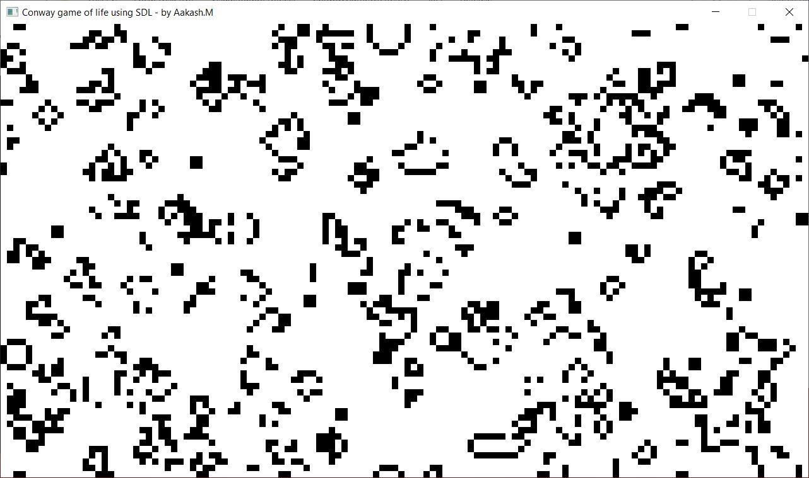

# ConwayGameOfLifeSDL
A simple graphical simulation of Conway's game of life algorithm using SDL graphics library. Conway's game of life is Turing-complete and it is a zero-player game which functions using three simple rules:

    1. Any live cell with two or three live neighbours survives.
    2. Any dead cell with three live neighbours becomes a live cell.
    3. All other live cells die in the next generation. Similarly, all other dead cells stay dead.

Source: https://en.wikipedia.org/wiki/Conway%27s_Game_of_Life

# Preview

# Build Instructions
## Windows
1. Download the Windows SDL development libraries (Visual C++ libraries) from https://www.libsdl.org/download-2.0.php, extract the zip file to the same directory where the source files are present.
2. Configure the SDL include directories and library directories for the compiler and linker in Visual Studio 2019.
3. Switch to Release configuration and build the project.

## Linux (Ubuntu and Ubuntu based linux distributions):
1. Install SDL development libraries from repository

        sudo apt install libsdl2-dev
2. Compile the source code

        gcc *.c -o conwayGameOfLife $(pkg-config --cflags --libs sdl2)
3. Run the program

        ./conwayGameOfLife

# Downloads:
* 32-bit EXE and DLL for Windows: [Download](https://github.com/aakashm101/ConwayGameOfLifeSDL/tree/main/bin/x86)

* 64-bit EXE and DLL for Windows: [Download](https://github.com/aakashm101/ConwayGameOfLifeSDL/tree/main/bin/x64)

# Roadmap
* Add more features